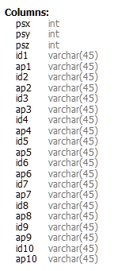

# 搜集WIFI信号并且建立指纹库

感谢李同学的指点

注意点：**要超过10AP点**（可自行更改）

**x,y为坐标，z为楼层**

## 接口代码（FLASK）

```python
@positional_info_bp.route("/position/createNewPS/<int:_psx>/<int:_psy>/<int:_psz>/<_id1>/<int:_ap1>/<_id2>/<int:_ap2>/<"
                          "_id3>/<int:_ap3>/<_id4>/<int:_ap4>/<_id5>/<int:_ap5>/<_id6>/<int:_ap6>/<_id7>/<int:_ap7>/<_id8"
                          ">/<int:_ap8>/<_id9>/<int:_ap9>/<_id10>/<int:_ap10>", methods=['GET'])
def _create_new_position(_psx, _psy, _psz, _id1, _ap1, _id2, _ap2, _id3, _ap3, _id4, _ap4, _id5, _ap5, _id6, _ap6, _id7,
                         _ap7, _id8, _ap8, _id9, _ap9, _id10, _ap10):
    pdb = position_info_db.PositionDB()
    result = pdb.create_new_position(_psx, _psy, _psz, _id1, _ap1, _id2, _ap2, _id3, _ap3, _id4, _ap4, _id5, _ap5,
                                     _id6, _ap6, _id7, _ap7, _id8, _ap8, _id9, _ap9, _id10, _ap10)
    pdb.close_db()
    return str(result)


@positional_info_bp.route("/position/deleteSpePS/<int:_psx>/<int:_psy>/<int:_psz>", methods=['GET'])
def _delete_specific_position(_psx, _psy, _psz):
    pdb = position_info_db.PositionDB()
    result = pdb.delete_spe_position(_psx, _psy, _psz)
    pdb.close_db()
    return str(result)


@positional_info_bp.route("/position/getLatestPS", methods=['GET'])
def _get_latest_position_info():
    pdb = position_info_db.PositionDB()
    result = pdb.get_latest_position_info()
    pdb.close_db()
    return result    #JSON
```

## 方法代码

```python
    def create_new_position(self, _psx: int, _psy: int, _psz: int, _id1: str, _ap1: int, _id2: str, _ap2: int, _id3: str, _ap3: int, _id4: str, _ap4: int, _id5: str, _ap5: int,
                            _id6: str, _ap6: int, _id7: str, _ap7: int, _id8: str, _ap8: int, _id9: str, _ap9: int, _id10: str, _ap10: int):
        pre_sql = "SELECT psx,psy,psz FROM {}".format(self.psition)
        self.cursor.execute(pre_sql)
        res = self.cursor.fetchall()
        for (x, y, z) in res:
            if x == _psx and y == _psy and z == _psz:
                return -1
        create_sql = "INSERT INTO {} VALUES (%s, %s, %s, %s, %s, %s, %s, %s, %s, %s, %s, %s, %s, %s, %s, %s, %s, %s, %s, %s, %s, %s, %s)".format(self.psition)
        self.cursor.execute(create_sql, [_psx, _psy, _psz, _id1, _ap1, _id2, _ap2, _id3, _ap3, _id4, _ap4, _id5, _ap5,
                                         _id6, _ap6, _id7, _ap7, _id8, _ap8, _id9, _ap9, _id10, _ap10])
        # sql = "INSERT INTO positioninfo VALUES ({}, {}, {}, {}, {})"
        self.conn.commit()
        return 0

    def delete_spe_position(self, _psx: int, _psy: int, _psz: int):
        sql = "SELECT psx,psy,psz FROM {}".format(self.psition)
        self.cursor.execute(sql)
        res = self.cursor.fetchall()
        for (x, y, z) in res:
            if x == _psx and y == _psy and z == _psz:
                delete_sql = "DELETE FROM {} WHERE psx = %s and psy = %s and psz = %s".format(self.psition)
                self.cursor.execute(delete_sql, [_psx, _psy, _psz])
                self.conn.commit()
                return 0
        return -1

    def get_latest_position_info(self):
        sql = "SELECT psx,psy,psz,id1,ap1,id2,ap2,id3,ap3,id4,ap4,id5,ap5,id6,ap6,id7,ap7,id8,ap8,id9,ap9,id10,ap10 " \
              "FROM {}".format(self.psition)
        self.cursor.execute(sql)
        res = self.cursor.fetchall()
        json_dict = {

        }
        for (x, y, z, id_1, ap_1, id_2, ap_2, id_3, ap_3, id_4, ap_4, id_5, ap_5, id_6, ap_6, id_7, ap_7, id_8, ap_8, id_9, ap_9, id_10, ap_10) in res:
            key_str = str(x) + ',' + str(y) + ',' + str(z)
            json_dict[key_str] = {
                id_1: ap_1,
                id_2: ap_2,
                id_3: ap_3,
                id_4: ap_4,
                id_5: ap_5,
                id_6: ap_6,
                id_7: ap_7,
                id_8: ap_8,
                id_9: ap_9,
                id_10: ap_10
            }
        return jsonify(json_dict)
```


## 数据库格式如下



## 导出的JSON格式如下

```javascript
    "208,602,0": {
        "0a:69:6c:b9:70:c5": 40,
        "0a:69:6c:b9:70:c6": 40,
        "0e:69:6c:b9:70:c5": 40,
        "0e:69:6c:b9:72:0f": 38,
        "12:69:6c:b9:70:c6": 40,
        "12:69:6c:b9:72:0f": 34,
        "16:69:6c:b9:70:c5": 40,
        "16:69:6c:b9:70:c6": 39,
        "16:69:6c:b9:72:0f": 37,
        "16:69:6c:b9:72:10": 41
    },
```

